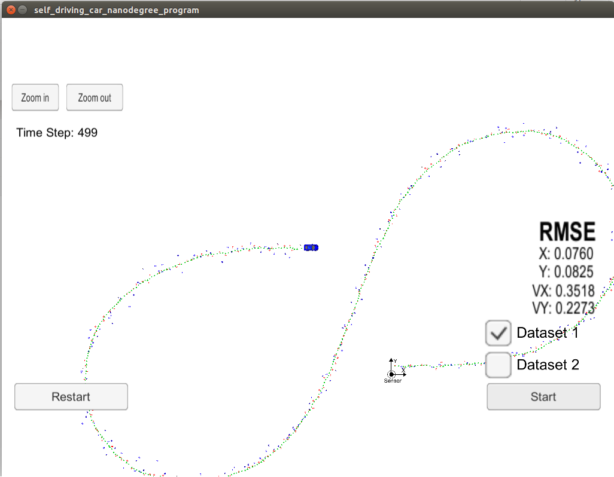
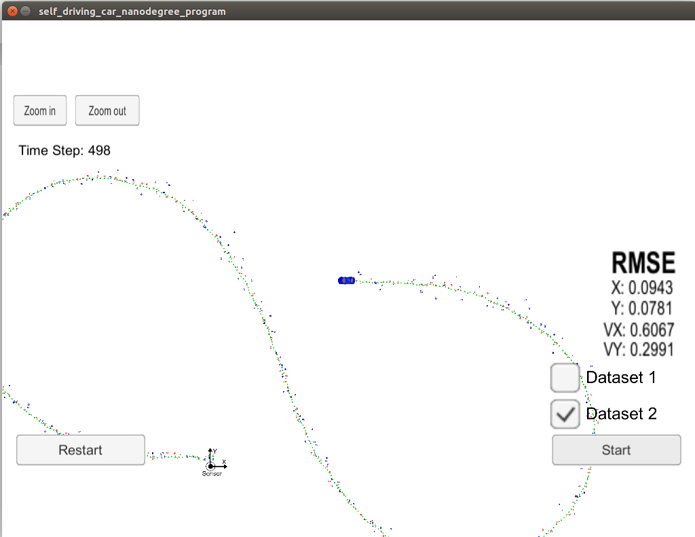

# Term - 2 - Project - 2 : Unscented Kalman Filter - Object Tracking with Sensor Fusion
Udacity Self-Driving Car Nanodegree - Unscented Kalman Filter Implementation

Dataset - 1 - Output             |  Dataset - 2 - Output
:-------------------------:|:-------------------------:
[](https://youtu.be/Ruo6xQsyOdE)  |  [](https://youtu.be/MBGmpNirUSw)

## Overview
This project consists of implementing an [Unscentted Kalman Filter](https://en.wikipedia.org/wiki/Kalman_filter#Unscented_Kalman_filter) with C++. A simulator provided by Udacity ([which is available here](https://github.com/udacity/self-driving-car-sim/releases)) generates RADAR and LIDAR measurements of the position and velocity of an object, and the Unscented Kalman Filter[UKF] must use those measurements to predict the position of the object. The communication between the simulator and the UKF is done using [WebSocket](https://en.wikipedia.org/wiki/WebSocket) using the [uWebSockets](https://github.com/uNetworking/uWebSockets) implementation on the UKF side.
To get this project started, Udacity provides a seed project that could be found [here](https://github.com/udacity/CarND-Unscented-Kalman-Filter-Project).

## Prerequisites

The project has the following dependencies (from Udacity's seed project):

- cmake >= 3.5
- make >= 4.1
- gcc/g++ >= 5.4
- Udacity's simulator.

For instructions on how to install these components on different operating systems, please, visit [Udacity's seed project](https://github.com/udacity/CarND-Extended-Kalman-Filter-Project). As this particular implementation was done on Linux Ubuntu, the rest of this documentation will be focused on Linux.

In order to install the necessary libraries, use the [install-xxxx.sh](./install-xxxx.sh) based on your operating system.

## Compiling and Executing the Project

These are the suggested steps:

1. Clone the repo and cd to it on a Terminal.
2. Clone this repo.
3. Make a build directory: `mkdir build && cd build`
4. Compile: `cmake .. && make`
5. Start the Simulator
6. Run it by the following command: 
   * `./UnscentedKF`
  
## Running the Filter

From the build directory, execute `./UnscentedKF`. The output should be:

```
Listening to port 4567
Connected!!!
```

## Results

- The RMSE values with both LASER and RADAR sensors are as follows:

|Algorithm |RMSE Values  |Px    |Py    |Vx    |Vy    |
|------|------|------|------|------|------|
|UKF|Dataset - 1  |0.0760|0.0825|0.3518|0.2273|
|EKF|Dataset - 1  |0.0955|0.0838|0.4504|0.4361|
|UKF|Dataset - 2  |0.0943|0.0781|0.6067|0.2991|
|EKF|Dataset - 2  |0.0744|0.0959|0.4586|0.4947|

Dataset - 1 - RMSE            |  Dataset - 2 - RMSE
:-------------------------:|:-------------------------:
  |  
